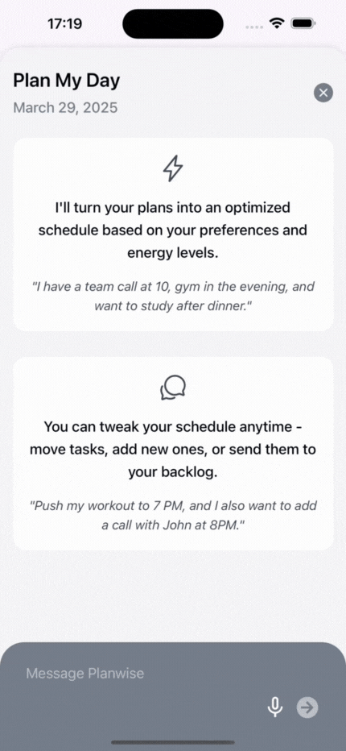
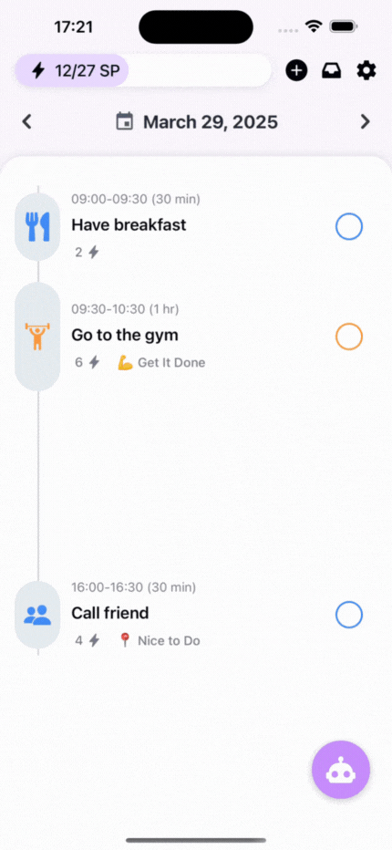
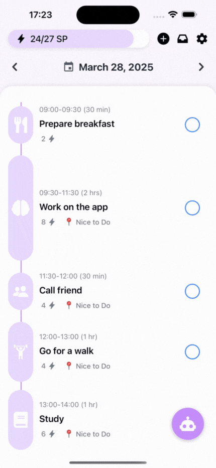
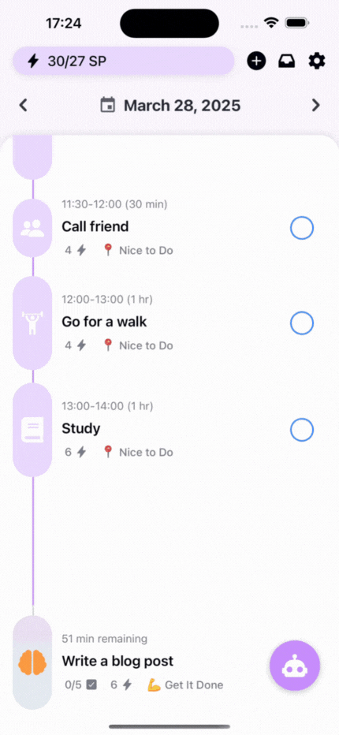
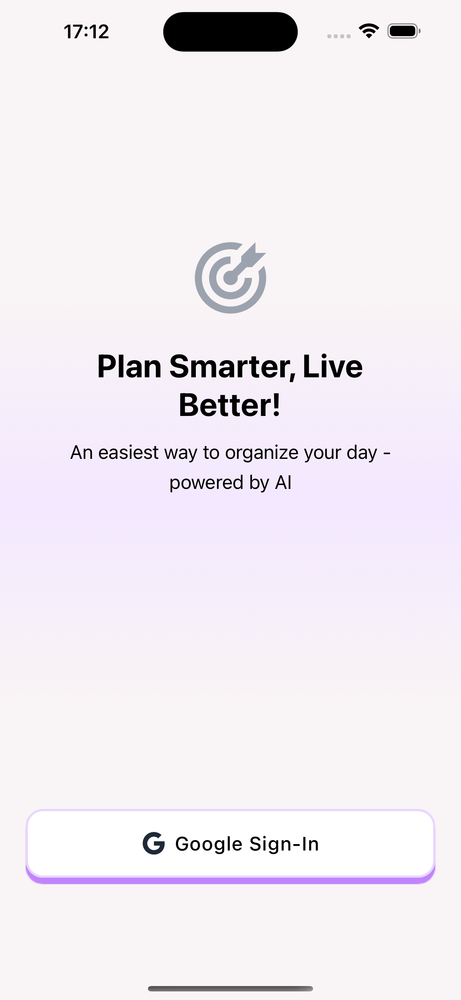
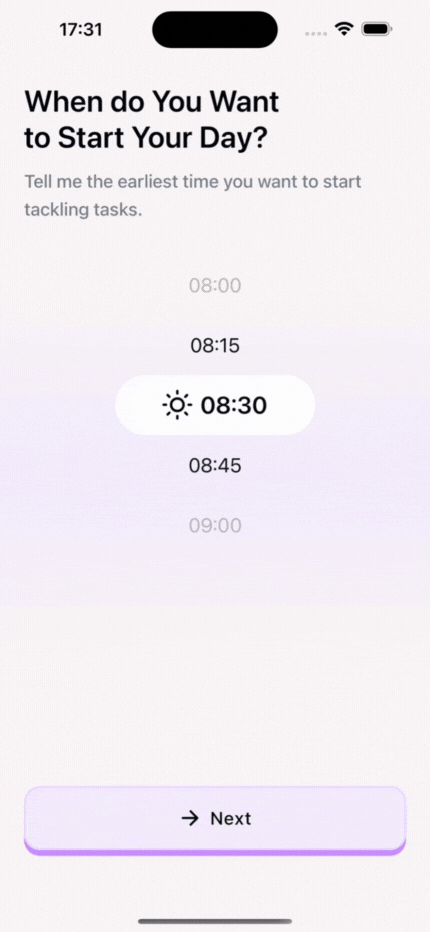

# Planwise

Planwise is an AI-powered scheduler app designed to help users plan their day effortlessly through voice input and intelligent scheduling. Instead of wasting mental energy manually structuring their day - only to end up overwhelmed and unproductive - users can simply speak their plans, and Planwise will do the rest.
  
By leveraging AI, Planwise prevents overload, prioritises tasks intelligently, and adapts schedules based on individual productivity patterns and workload capacity. Unlike traditional calendars that merely record events, Planwise functions as a proactive personal productivity assistant, helping users focus on what truly matters while avoiding burnout.

## Table of Contents
-   [Key Features](#key-features)
-   [Additional Features](#additional-features)
-   [Technologies](#technologies)
-   [Contact](#contact)

## Key Features
- **Speak your plans to the AI — get a personalized schedule instantly**
- **Add tasks manually, or let AI auto-fill the details for you**
- **Stay in flow with a focused task timer**
- **Create and manage a backlog of tasks (AI can help with that too)**
- **Seamlessly move tasks between your backlog and schedule**

<table>
  <tr>
    <td></td>
    <td></td>
    <td></td>
  </tr>
  <tr>
    <td></td>
    <td></td>
    <td></td>
  </tr>
</table>

## Additional Features
- **Fast, passwordless login via Google**
- **Effortless onboarding — tell the app your preferences so AI can personalize your experience**
- **View and update your profile and scheduling preferences anytime**

<table>
  <tr>
    <td></td>
    <td></td>
    <td></td>
  </tr>
</table>

## Technologies
- 
- 
- 
- 
- 

## Contact

-   LinkedIn: [Danyl Kecha](https://www.linkedin.com/in/danylkecha/)
-   Mail: danyl.kecha.uk@gmail.com
-   GitHub: [ke444a](https://github.com/ke444a)
-   Twitter: [@ke444a](https://twitter.com/ke444a)
-   Hashnode: [blog.danylkecha.com](https://blog.danylkecha.com)
